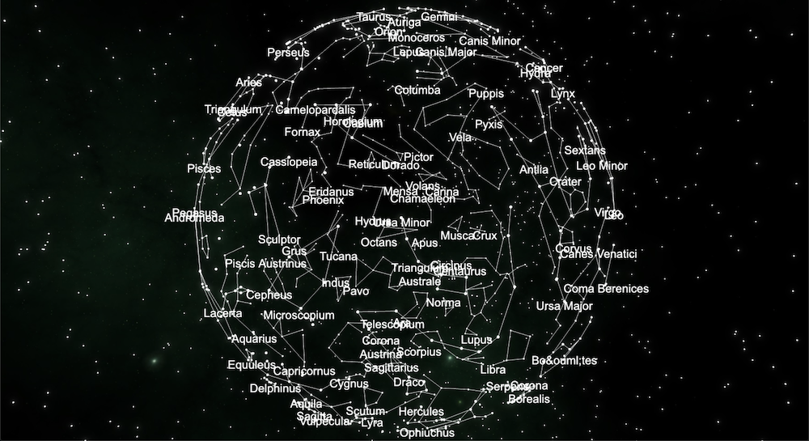

# constellation-sonification
Sonification of constellations using Babylon.js and Tone.js (Work in progress)

Click on any star of a constellation to play music. Midi notes are mapped to the Apparent magnitude of the star.

Data obtained from https://virtualsky.lco.global/

